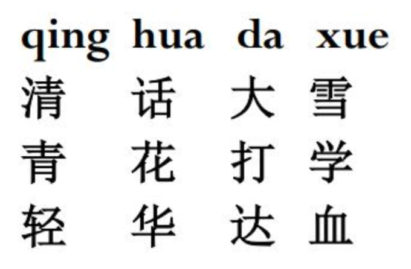
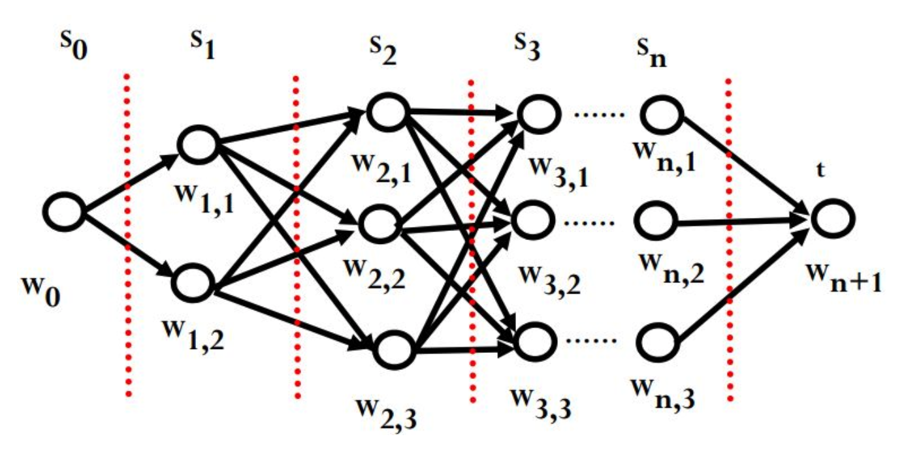

# 拼音输入法

## 算法的基本思路与实现

### 问题描述

输入一个拼音串，输出最有可能的一个汉字串，即拼音输入法。

例如：输入

```
qing hua da xue
```

输出

```
清华大学
```

### 隐马尔科夫模型(HMM)

对于一个输入拼音串，每个拼音都可能有多个汉字对应。



因此我们需要从这些汉字的组合中选取最优的一个。

我们可以由语料库（大量的句子）经过处理计数得到每个汉字出现的概率以及两个汉字同时相邻出现的概率，但是我们不能直接计数得到某个句子出现的概率，因此这个模型可以当做一个隐马尔科夫模型，每个汉字串就是它的一个状态。

我们的目标就是使这个串的概率达到最大.
$$
max\prod_{i=1}^{n} P(w_i|w_{i-1})\\
P(w_i|w_{i-1}) = \frac{Count(w_{i-1}w_i)}{Count(w_{i-1})}
$$

值得一提的是，为了照顾到二元组出现次数为0的情况，我们可以对概率做平滑处理。
$$
P(w_i|w_{i-1}) = \lambda \frac{Count(w_{i-1}w_i)}{Count(w_{i-1})} + (1 - \lambda)P(w_{i})
$$
其中$\lambda$是一个人为规定的参数。

除此之外我还对出现在句首的字符进行了统计，对句首字符概率进行了优化。

### 维特比算法(Viterbi Algorithm)

要求解这个HMM问题，我们需要使用维特比算法。

维特比算法是一种动态规划算法，下图每一层的节点都与相邻的层的所有节点相连接，且汉字的二元概率可以看做两节点的距离，本质问题是求解起点到终点的最长路径。



我们首先对概率取对数，将概率的积变为概率对数的和，然后逐层应用维特比算法。

容易看出，由于只有相邻层有边，我们不需要遍历所有的路径，对于当前层的某个节点，只需对前一层的节点进行遍历，找到前一层中到当前节点距离与其到起点距离之和最大的节点即可。

### 二元字模型的初步实现

我定义了一个节点类

```python
class node():
    def __init__(self, ch, pr, prev):
        self.ch = ch
        self.pr = pr
        self.prev = prev
```

之后逐层遍历即可

```python
def run(pylist, lam=0.99):
    for py in pylist:
        if py not in pch:
            return ['Wrong piyin']
    nodes = []

    # first layer
    nodes.append([node(x, fir_p.get(x, -25.0), None) for x in pch[pylist[0]]])

    # middle layers
    for i in range(len(pylist)):
        if i == 0:
            continue
        nodes.append([node(x, 0, None) for x in pch[pylist[i]]])
        for nd in nodes[i]:
            nd.pr = nodes[i - 1][0].pr + getpr(nodes[i - 1][0].ch, nd.ch, lam)
            nd.prev = nodes[i - 1][0]
            for prend in nodes[i - 1]:
                if prend.pr + getpr(prend.ch, nd.ch, lam) > nd.pr:
                    nd.pr = prend.pr + getpr(prend.ch, nd.ch, lam)
                    nd.prev = prend

    # back propagation
    nd = max(nodes[-1], key=lambda x: x.pr)
    chs = []
    while nd is not None:
        chs.append(nd.ch)
        nd = nd.prev
    return list(reversed(chs))
```

遍历完后在最后一层找到概率最大的一个节点，回溯便可以找到一条汉字串（已经记录了每个节点的前一个节点）。

## 实验效果

| 测试集 | 句子数 | 字数 | 句正确率 | 字正确率 |
| :----: | :----: | :--: | :------: | :------: |
| test1  |  797   | 7471 |  27.85%  |  76.68%  |
| test2  |  334   | 3363 |  31.14%  |  79.54%  |

正确的例子：

```
ni zai gan shen me a tuan zhang
你在干什么啊团长
jing ji jian she he wen hua jian she tu chu le shi ba da jing shen de zhong yao xing
经济建设和文化建设突出了十八大精神的重要性
zhong guo pin kun di qu shi xian wang luo fu wu quan fu gai
中国贫困地区实现网络服务全覆盖
ren gong zhi neng dao lun hen you yi si
人工智能导论很有意思
mou ke xue de chao dian ci pao
某科学的超电磁炮
zhong guo gong chan dang yuan de chu xin he shi ming shi wei zhong guo ren min mou xing fu wei zhong hua min zu mou fu xing
中国共产党员的初心和使命是为中国人民谋幸福为中华民族谋复兴
```

错误的例子：

```
bei jing shi yi ge mei li de cheng shi
北京市一个美丽的城市
qing wa gua gua gua
青瓦刮刮刮
ni men que ding zhe xie qi guai de ju zi neng zheng que shu chu
你们确定这些奇怪的橘子能正确输出
ai yin si tan ti chu le guang yi xiang dui lun
爱因斯坦提出了广益相对论
zheng he xia xi yang wei qing hua ci de xun su jue qi ti gong le li shi qi ji
整合下西洋为清华次的迅速崛起提供了历史契机
xun xun mi mi leng leng qing qing qi qi can can qi qi
寻寻觅觅冷冷清清气其灿灿其妻
```

* 可以看到由于没有词库，可能会有一些奇怪的问题。

* 新闻语料导致青瓦台的出现次数远远超过青蛙，可以看出语料的重要性。

## 参数对比与性能分析

可以调整平滑率参数

|   test2    | $\lambda=0.9 $ | $\lambda=0.95$ | $\lambda=0.99$ | $\lambda=0.999$ | $\lambda=0.9999$ |
| :--------: | :------------: | :------------: | :------------: | :-------------: | :--------------: |
| 句正确率\% |     30.24      |     30.54      |     30.54      |      30.54      |      30.54       |
| 字正确率\% |     79.54      |     79.36      |     79.48      |      79.66      |      79.69       |

|   test2    | $\lambda=0.6 $ | $\lambda=0.7 $ | $\lambda=0.8 $ |
| :--------: | :------------: | :------------: | :------------: |
| 句正确率\% |     26.05      |     27.84      |     29.34      |
| 字正确率\% |     78.32      |     79.07      |      79.6      |

## 改进方案

### 三元字模型

可以考虑改进二元字模型至三元字模型，这样我们需要先统计三元组的出现概率，然后改进维特比算法的实现。

我们可以考虑在二元概率的基础乘上三元组的信息：
$$
P(w_3|w_1, w_2) = \frac{Count(w_1w_2w_3)}{Count(w_1w_2)}P(w_3|w_2)
$$

##### 实验效果

| 测试集 | 正确句子/句子数 | 正确字数/字数 | 句正确率 | 字正确率 |
| :----: | :-------------: | :-----------: | :------: | :------: |
| test1  |     342/797     |   6206/7471   |  42.91%  |  83.07%  |
| test2  |     175/334     |   2951/3363   |  52.4%   |  86.68%  |

一些比二元输入法有明显提升的例子：

```
zheng he xia xi yang wei qing hua ci de xun su jue qi ti gong le li shi qi ji
郑和下西洋为青花瓷的迅速崛起提供了历史契机
qu nan ji chi mi fen kai you bu
去南极吃米粉开优步
tan tan jian jian neng neng fou fou ding ding lv
碳碳键键能能否否定定律
jing zhuang ti you tong xin de xian wei xi bao ceng zu cheng
晶状体有通信的纤维细胞层组成
ting che zuo ai feng lin wan
停车坐爱枫林晚
xiao ji ji ji ji ji
小鸡叽叽叽叽
chi ma ma xiang
吃嘛嘛香
```

晶状体、青花瓷等三字短语在加入三元信息后能很容易的分辨，可以看到提升的效果还是比较明显的。


## 总结

* 语料库对算法表现的影响是决定性的，本次训练所用的是新浪新闻文本数据，因此新闻用词比较多，对新闻常见字词的偏向度较高，对于诗句这种没有出现过的文本可以说是完全不适合的。
* 本人所用的语料库也没有经过严格的分句，是根据有标点符号就断句的原则整理的句子语料，因此可能也会有偏差。
* 算法的数据库体积十分大，加载也需较长时间，这在实际应用中是不能接受的，可见可改进的地方还有很多。
* 可以继续完善多音字支持，对多音字的不同读音分开处理，当然这需要标记好读音的文本库，现成的有pypinyin库可用于标注拼音。

## 代码

支持命令行形式提供输入文件名和输出文件名并运行程序

输入文件范例(./data/input_example.txt)：

```
yi xi jin ping tong zhi wei zong shu ji de dang zhong yang
zou zhong guo te se she hui zhu yi dao lu
hu lian wang chan ye you ju da qian li
zhong guo pin kun di qu shi xian wang luo fu wu quan fu gai
zou chu qing hua da xue te se de shi jie yi liu da xue dao lu
Ma shao ping lao shi ru shi shuo
Qing hua da xue de ren gong zhi neng dao lun ke cheng shi fen de you qu
huan ying lai dao wang zhe rong yao
```

输出文件范例(./data/ouput_example.txt)：

```
以习近平同志为总书记的党中央
走中国特色社会主义道路
互联网产业有巨大潜力
中国贫困地区实现网络服务全覆盖
走出清华大学特色的世界一流大学道路
马少平老师如是说
清华大学的人工智能导论课程十分的有趣
欢迎来到王者荣耀
```

##### 运行方法：

二元模型: python pinyin ../data/input.txt ../data/output.txt

三元模型: python pinyin3 ../data/input.txt ../data/output.txt

##### 清华云盘：https://cloud.tsinghua.edu.cn/d/c9542280e3a94b5ebd5c/

##### github：https://github.com/wmhst7/PinYin

(github因文件大小限制，无三元模型所需文件)

